# Vision-First Presentation Generation Worker

> Ein produktiver Microservice, der aus Rohmaterial (PDF, DOCX, XLSX, Text, Bilder) **fertige
> PowerPoint-Präsentationen** erzeugt — und dabei die mitgegebene Firmenvorlage **nicht blind
> befüllt, sondern zuerst mit einem multimodalen LLM ansieht und versteht**, um Text nur dort zu
> platzieren, wo er ins Design passt.

*Technisches Portfolio · Architektur & Engineering-Entscheidungen · Kein Quellcode*

---

## Inhalt

- [Warum liegt hier kein Code?](#warum-liegt-hier-kein-code)
- [Das Problem](#das-problem)
- [Der Lösungsansatz: Vision-First](#der-lösungsansatz-vision-first)
- [Was das System kann](#was-das-system-kann)
- [Leitprinzipien](#leitprinzipien)
- [Tech-Stack](#tech-stack)
- [Architektur](#architektur)
- [Engineering Case Studies](#engineering-case-studies)
- [Architecture Decision Records](#architecture-decision-records)
- [Verifizierte Ergebnisse](#verifizierte-ergebnisse)
- [Galerie: Before / After](#galerie-before--after)
- [Roadmap & Stand](#roadmap--stand)
- [Kontakt](#kontakt)

---

## Warum liegt hier kein Code?

Dieses Repository ist bewusst ein **Dokumentations- und Architektur-Showcase**. Der Quellcode
gehört dem Auftraggeber und ist proprietär. Was hier gezeigt wird, ist die **Ingenieursleistung**
dahinter: die Systemarchitektur, die getroffenen Design-Entscheidungen und die konkret gelösten
Engineering-Herausforderungen — ohne interne Implementierungslogik oder Infrastruktur offenzulegen.

---

## Das Problem

Automatische Foliengeneratoren gibt es viele. Fast alle scheitern am selben Punkt: Sie behandeln
eine Vorlage als Ansammlung von **Platzhaltern** und stempeln generierten Text hinein. Das Ergebnis
sieht bei einer echten, designten Firmenvorlage kaputt aus — Text landet auf Fotos, über
Farbbalken, quer durch das Logo; ein Titel, der im Deutschen passt, läuft in der englischen Version
aus dem Kasten; das Corporate Design wird zerstört, weil der Generator nicht *weiß*, welches Element
Marke, welches Träger-Design und welches ein austauschbares Foto ist.

Der Kern des Problems: Ein Generator, der eine Folie nur als XML-Baum aus Formen liest, **rät** die
Rolle jedes Elements aus dessen Geometrie. Dieses Raten ist die Wurzel fast aller
Design-Zerstörungen.

**Der Anspruch:** aus beliebigem Quellmaterial eine inhaltlich sinnvolle, mehrsprachige
Präsentation erzeugen, die aussieht, als hätte sie jemand von Hand in der Firmenvorlage gebaut —
mit erhaltenem Corporate Design.

---

## Der Lösungsansatz: Vision-First

Statt die Vorlage zu raten, **sieht** der Worker sie an. Jede Vorlagenfolie wird zu einem Bild
gerendert und von einem multimodalen LLM analysiert, das ein strukturiertes Verständnis-Objekt pro
Folie liefert: Zweck der Folie, lesbare Textzonen mit Lesbarkeits-Bewertung, und eine Klassifikation
jedes Bild-/Formelements nach Rolle (Marke, Träger-Design, austauschbares Foto). Erst auf dieser
verstandenen Grundlage werden Inhalt geplant, Folien gerendert und Layouts selbst geprüft.

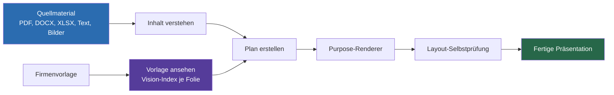

---

## Was das System kann

| Fähigkeit | Details |
|---|---|
| **Eingabe** | PDF, DOCX, XLSX, freier Text und mitgegebene Bilder als Quellmaterial |
| **Vorlagen-Verständnis** | Jede Vorlagenfolie wird per Vision-LLM analysiert; Ergebnis wird inhalts-adressiert zwischengespeichert |
| **Folien-Zwecke** | 9 spezialisierte Renderer (Titel, Bullet-Inhalt, Foto-Held, Foto-Galerie, Zitat, Statistik, Abschluss, Sektionstrenner, gemischt) |
| **Design-Erhalt** | Drei-Schichten-Rollentaxonomie trennt Marke, Träger-Design und austauschbares Foto — Text landet nie auf geschützten Elementen |
| **Platzierung** | Hindernis-Karte plus „größte freie einfarbige Zone" statt starrer Platzhalter |
| **Selbstprüfung** | Geometrische Überlappungsprüfung nach dem Rendern; Text weicht aus oder verkleinert sich |
| **Statistiken** | Echte native PowerPoint-Diagramme (Balken/Säulen/Linie/Kreis), nicht als Bild |
| **Bilder** | Optionale Web-Bildbeschaffung mit anschließender Vision-Verifikation gegen den Slot-Bedarf |
| **Mehrsprachig** | Ausgabe in mehreren Sprachen; lokalisierte Platzhalter und Fortschrittsmeldungen |

---

## Leitprinzipien

**Verstehen statt raten.** Die Rolle eines Elements (Marke / Träger-Design / austauschbares Foto)
wird explizit klassifiziert, nicht aus seiner Position oder Größe erraten. Diese eine Entscheidung
verhindert die meisten Design-Zerstörungen.

**Gemessene Platzierung statt starrer Platzhalter.** Wo Text hinkommt, wird aus der konkreten Folie
bestimmt — welche Flächen sind einfarbig und frei? — nicht aus fest verdrahteten Koordinaten.

**Selbstkontrolle vor Auslieferung.** Nach dem Rendern prüft der Worker sein eigenes Layout auf
Überlappungen und korrigiert, bevor die Datei den Nutzer erreicht.

**Robuster Rückfall.** Ist die Vision-Analyse nicht verfügbar, greift ein deterministischer
Fallback-Index. Das System stürzt nicht ab, es degradiert kontrolliert.

---

## Tech-Stack

- **Sprache & Runtime:** Python, Flask
- **Präsentations-Engine:** python-pptx (inkl. nativer Diagramme)
- **Vorlagen-Rasterung:** LibreOffice + poppler (Folie → Bild für die Vision-Analyse)
- **Bildsynthese:** Pillow / NumPy für generierte Hintergründe und Icons
- **Verständnis:** selbst gehostetes multimodales LLM (on-premise, keine Cloud)
- **Quellextraktion:** PDF-, DOCX- und XLSX-Parsing
- **Persistenz & Betrieb:** relationale Datenbank für Aktivitäts-Logging, optionaler Cache,
  containerisiert als registrierter Worker in einer Agenten-Plattform
- **Integrationen:** Übersetzungs-Worker (mehrsprachige Ausgabe), Websuche-Worker (Bilder/Fakten)

---

## Architektur

### Systemkontext

Der Worker ist ein containerisierter Microservice in einer Agenten-Plattform. Er nimmt einen
Generierungs-Job entgegen (Quellmaterial, Firmenvorlage, Optionen), analysiert und rendert, meldet
Fortschritt pro Schritt zurück und liefert eine fertige Präsentationsdatei.

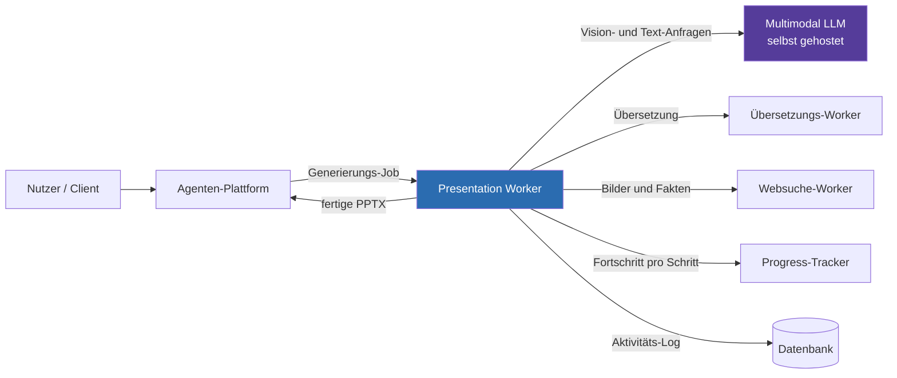

### Die Generierungs-Pipeline

Ein Job durchläuft sieben Stufen. Vorlagen-Analyse und Inhalts-Verständnis sind unabhängig; erst der
Plan führt beide zusammen. Jede Stufe meldet granularen Fortschritt bis auf Folienebene.

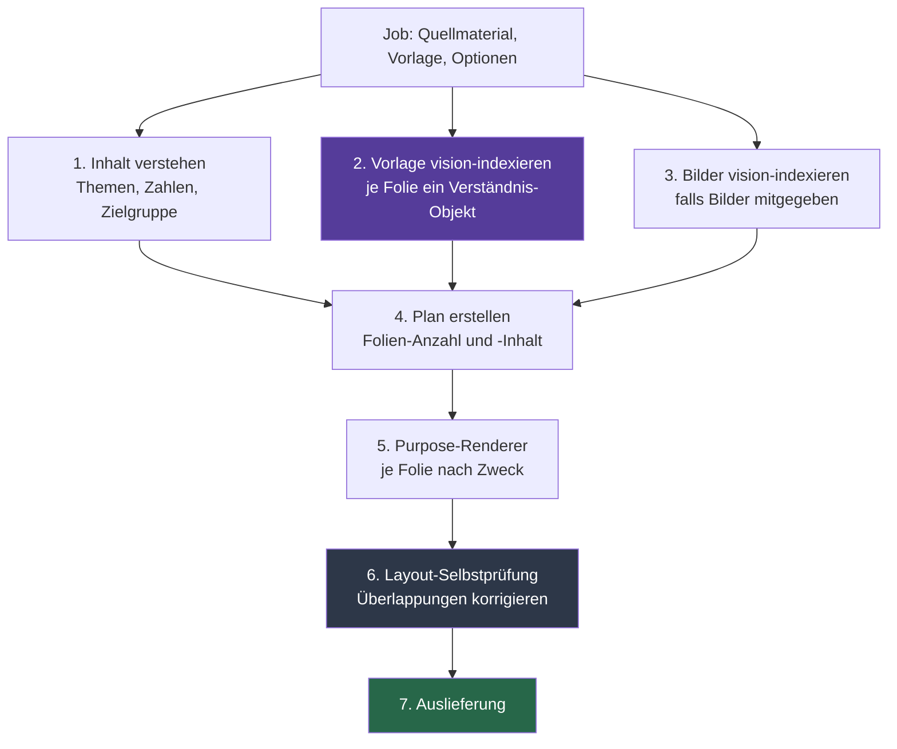

### Vorlagen-Verständnis (Vision-Indexierung)

Das Herzstück. Statt die Vorlage als Form-Baum zu raten, wird jede Folie zu einem Bild gerendert und
vom multimodalen LLM analysiert. Das Ergebnis ist ein strukturiertes, inhalts-adressiert
zwischengespeichertes Verständnis-Objekt.

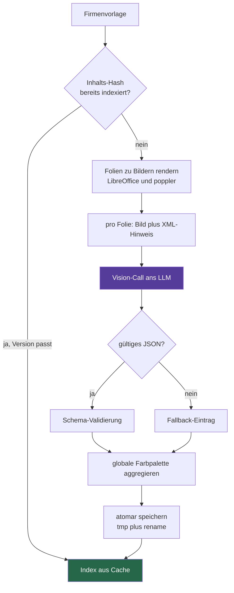

Pro Folie enthält das Verständnis-Objekt unter anderem den **Zweck** (einer von neun Typen), die
**visuelle Dichte** und eine sprachfreie **Beschreibung**, die **Textzonen** mit Position,
Größenschätzung, Hintergrund-Art, Eignung (Titel / Untertitel / Body …) und einer
**Lesbarkeits-Bewertung**, sowie **Bild-Klassifikationen** je Form (Rolle, Träger-Subtyp, Füllstatus,
Bildunterschrift, austauschbar-ja/nein, Hindernis-für-Text). Fällt die Vision-Analyse aus, liefert ein
deterministischer Fallback-Index einen konservativen Ersatz.

### Die Drei-Schichten-Rollentaxonomie

Der Kern des Design-Erhalts. Die Rolle eines Elements wird in drei unabhängige Achsen zerlegt, statt
sie aus der Geometrie zu raten — genau dieses Raten war zuvor die Wurzel der Design-Zerstörungen.

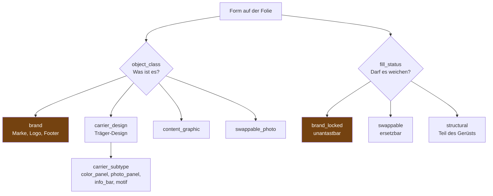

So kann der Renderer sauber unterscheiden: ein Logo (Marke, gesperrt) bleibt; ein Farbpanel
(Träger-Design, strukturell) bleibt und darf sogar Text tragen; ein Inhaltsfoto (austauschbar) darf
ersetzt oder entfernt werden.

### Purpose-basierte Renderer

Der Plan ordnet jedem Inhalt einen von neun **Folien-Zwecken** zu; pro Zweck gibt es einen
spezialisierten Renderer und ein **Inhalts-Budget** (maximale Titel-, Untertitel- und Bullet-Längen),
das Überläufe von vornherein begrenzt.

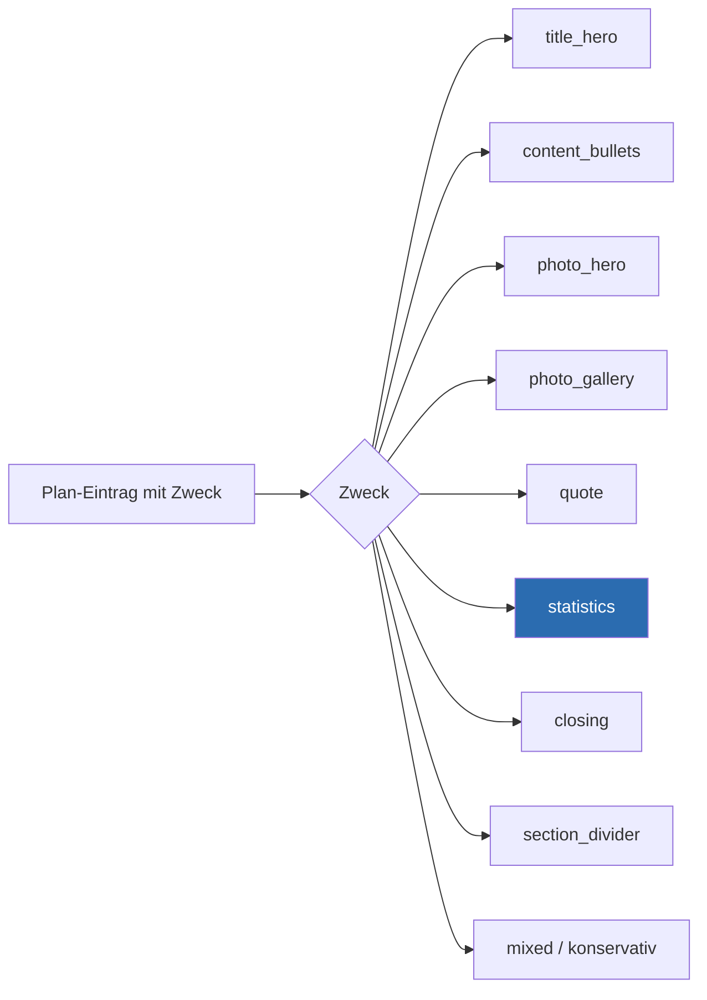

Passt eine Vorlagenfolie mehrfach zum selben Zweck, verteilt ein Round-Robin-Verfahren die Inhalte
über alle gleichartigen Vorlagenfolien, damit die Layouts abwechslungsreich bleiben.

### Platzierung: „Text nur auf freier Fläche"

Für den nativen Render-Pfad gilt eine harte Regel: Text kommt **nur auf einfarbige, freie Flächen**,
nie auf Fotos, Muster, Geometrie oder Markenelemente. Umgesetzt über eine Hindernis-Karte und die
Suche nach der größten freien Zone.

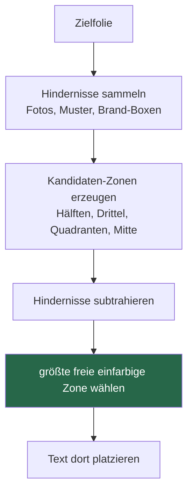

Über zwanzig Kandidaten-Zonen werden geprüft (Folienhälften, Drittel längs und quer, Quadranten,
zentrierte Zonen abnehmender Größe, volle Folie mit Rand). Gewählt wird die größte hindernisfreie Zone.

### Layout-Selbstprüfung

Nach dem Rendern kontrolliert der Worker sein eigenes Ergebnis. Das ist bewusst eine **geometrische**
Prüfung — schnell und pro Folie bezahlbar; eine bild-basierte Vision-Prüfung pro Folie wäre zu teuer
und wurde als Nicht-Standard-Weg verworfen.

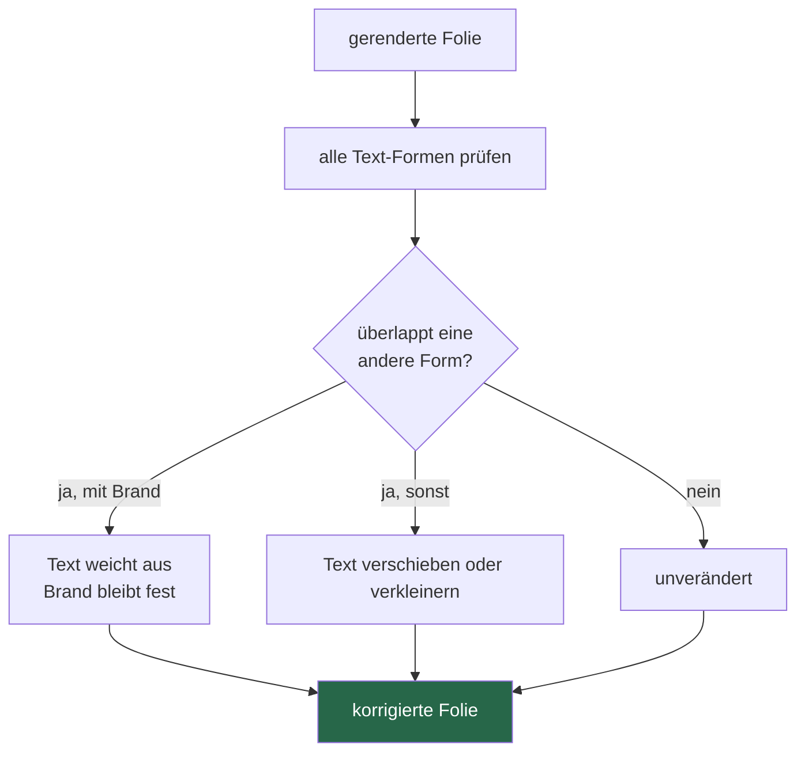

Marken-Boxen werden dabei als **feste Hindernisse** behandelt, nicht als bewegliche Textformen.

### Bilder aus dem Web mit Vision-Verifikation

Verlangt ein Folien-Slot ein Bild, das nicht mitgeliefert wurde, kann der Worker eines über den
Websuche-Worker beschaffen — aber nicht ungeprüft. Ein einzelner Vision-Call beantwortet zwei Fragen
zugleich.

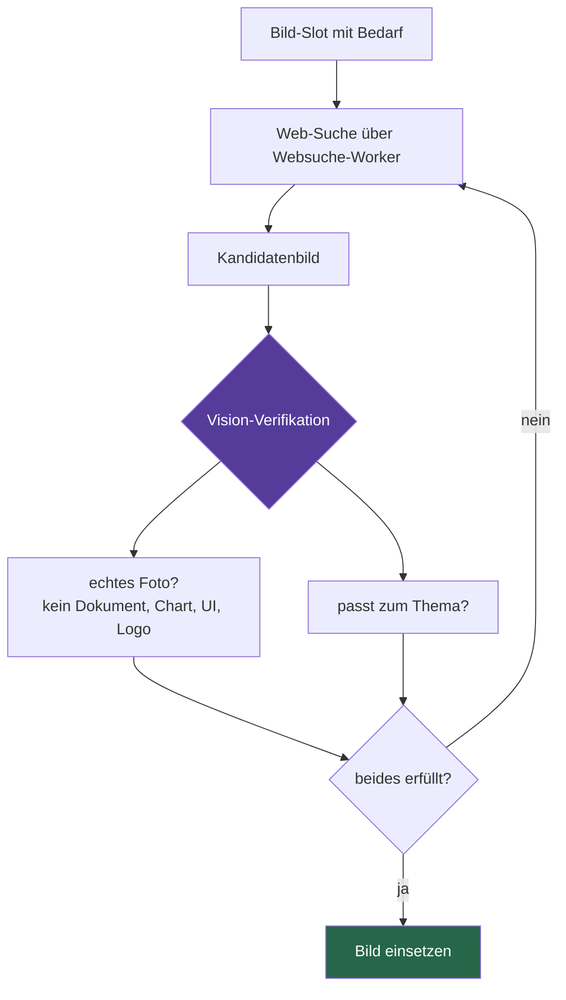

Verlangt der Slot ausdrücklich ein Diagramm oder eine Infografik, wird die „echtes Foto"-Pflicht
deterministisch abgeschaltet und nur der Themen-Match geprüft — sonst würde die Foto-Regel genau das
gewünschte Schaubild verwerfen.

### Statistiken als native Diagramme

Zahlen aus dem Quellmaterial werden nicht als Bild eingefügt, sondern als **echte
PowerPoint-Diagramme** (Balken, Säulen, Linie, Kreis) — im Ergebnis editierbar und dem Vorlagen-Stil
angepasst.

---

## Engineering Case Studies

Sieben Herausforderungen, je im Format **Problem → Ansatz → Lösung → Ergebnis**.

### 1. Vom Raten zum Sehen

**Problem.** Die naheliegende Art, eine Vorlage zu befüllen, liest sie als Baum aus Formen und
stempelt Text in Platzhalter. Bei einer echten Firmenvorlage zerstört das die Gestaltung: Text landet
auf Fotos, über Farbbalken oder quer durch das Logo, weil der Generator aus Position und Größe nur
**raten** kann, was eine Form bedeutet.

**Ansatz.** Das Problem ist nicht mit besserer Geometrie-Heuristik lösbar, sondern nur mit echtem
**Verständnis**. Jede Vorlagenfolie wird zu einem Bild gerendert und von einem multimodalen LLM
analysiert — so, wie ein Mensch die Folie ansehen würde.

**Lösung.** Ein Vision-Indexer erzeugt pro Folie ein strukturiertes Verständnis-Objekt (Folienzweck,
lesbare Textzonen mit Bewertung, Rollen-Klassifikation jedes Elements). Die Generierung baut
ausschließlich darauf auf. Weil die Analyse teuer ist, wird das Ergebnis inhalts-adressiert
zwischengespeichert.

**Ergebnis.** Der Generator weiß, was er vor sich hat, bevor er etwas platziert. Corporate Design
bleibt erhalten, weil Text nur dort landet, wo die Analyse Platz ausgewiesen hat.

### 2. Die Drei-Schichten-Rollentaxonomie

**Problem.** „Verstehe die Folie" ist zu grob. Eine einzige Rollen-Kategorie pro Element scheitert an
Mischfällen: Ein halbtransparenter Farbbalken ist Träger-Design *und* eine Fläche, die Text tragen
darf.

**Ansatz.** Die Rolle wurde in **drei unabhängige Achsen** zerlegt, damit jede Frage getrennt
beantwortet werden kann.

**Lösung.** Jedes Element trägt drei Attribute: *Was ist es?* (Marke, Träger-Design, Inhaltsgrafik,
austauschbares Foto), *welcher Träger-Subtyp?* (Farbpanel, Foto-Panel, Info-Leiste, Motiv) und
*darf es weichen?* (marken-gesperrt, austauschbar, strukturell). Erst diese Trennung erlaubt es, ein
strukturelles Panel zu erhalten und trotzdem zu betexten, während ein Foto entfernt werden darf und
ein Logo unantastbar bleibt.

**Ergebnis.** Die häufigste Klasse von Design-Fehlern — Marke/Träger fälschlich als austauschbar oder
umgekehrt — ist strukturell ausgeschlossen.

### 3. Marken-Erkennung durch Wiederkehr

**Problem.** Was gehört zur Marke und muss auf jeder Folie unangetastet bleiben? Das pro Vorlage von
Hand zu konfigurieren, skaliert nicht.

**Ansatz.** Marken-Elemente sind genau die, die sich **wiederholen** — ein Footer taucht auf vielen
Folien identisch auf, ein inhaltlicher Text nur einmal.

**Lösung.** Vor jeder Bearbeitung sammelt der Worker alle Texte und wiederkehrenden Bilder, die auf
mehreren Vorlagenfolien identisch vorkommen. Was eine Wiederkehr-Schwelle überschreitet, gilt als
Marke, wird verschont und später als **festes Layout-Hindernis** behandelt.

**Ergebnis.** Corporate-Elemente werden ohne Konfiguration erkannt und geschützt — allein aus der
Struktur der Vorlage.

### 4. „Text nur auf freier Fläche"

**Problem.** Selbst mit bekannten geschützten Elementen bleibt die Frage: Wohin mit dem Text? Starre
Koordinaten funktionieren nur für eine Vorlage und legen Text im Zweifel auf ein Foto.

**Ansatz.** Die Platzierung sollte aus der **konkreten Folie gemessen** werden, unter einer harten
Regel: nur einfarbige, freie Flächen.

**Lösung.** Der Worker baut eine Hindernis-Karte, erzeugt über zwanzig Kandidaten-Zonen, subtrahiert
die Hindernisse und wählt die größte verbleibende freie Zone.

**Ergebnis.** Text landet zuverlässig auf lesbarem Untergrund, ohne dass pro Vorlage Koordinaten
gepflegt werden.

### 5. Zwei-Stufen-Inhaltsverständnis

**Problem.** Aus einem langen Quelldokument soll ein strukturierter Plan entstehen. Verlangt man vom
LLM direkt strukturiertes JSON über den ganzen Text, kollidiert das mit dem Kontextfenster: Das JSON
wird am Token-Limit abgeschnitten und lässt sich nicht mehr parsen.

**Ansatz.** Das Verständnis wurde in **zwei Stufen** getrennt.

**Lösung.** Stufe A („Verstehen"): das LLM schreibt einen ausführlichen Plan in **natürlicher
Sprache** — kein JSON-Korsett, freies Strukturieren. Stufe B („Strukturieren"): es übersetzt diesen
Plan deterministisch ins Ziel-Schema. Die Aufteilung passt zum Kontextfenster; abgeschnittenes JSON
wird zusätzlich durch einen Retry mit höherem Token-Budget abgefangen.

**Ergebnis.** Robuste, parsebare Struktur auch bei langen, dichten Quelldokumenten — weil die
inhaltliche Arbeit von der formalen Verpackung getrennt ist.

### 6. Layout-Selbstprüfung

**Problem.** Auch mit sorgfältiger Platzierung können nach dem Rendern Überlappungen entstehen — etwa
wenn ein übersetzter Text länger ausfällt. Ohne Kontrolle würde das still ausgeliefert.

**Ansatz.** Der Worker soll sein Ergebnis prüfen, aber mit vertretbarem Aufwand. Eine Vision-Prüfung
pro Folie wäre am gründlichsten, aber zu teuer — bewusst verworfen.

**Lösung.** Eine **geometrische** Selbstprüfung misst Überlappungen aller Text-Formen. Kollidiert Text
mit einem beweglichen Element, wird er verschoben oder verkleinert; kollidiert er mit einer
Marken-Box, weicht der Text aus, während die Marke fest bleibt.

**Ergebnis.** Überlappungen werden vor der Auslieferung korrigiert statt still mitgeliefert — mit der
bewussten Grenze, dass rein farbliche Lesbarkeitsprobleme außen vor bleiben.

### 7. Web-Bilder mit Vision-Verifikation

**Problem.** Beschaffte Web-Bilder sind oft Textseiten, Diagramme, Screenshots, Logos oder thematisch
unpassend. Ungeprüft eingesetzt sieht das unprofessionell aus.

**Ansatz.** Ein **einziger** Vision-Call soll beide Fragen zusammen beantworten — echtes Foto? passt
es? — um Kosten zu sparen.

**Lösung.** Der Vision-Call liefert zwei Urteile: „echtes Foto" (mit expliziter Negativ-Liste — kein
Dokument, Diagramm, UI, Logo) und „passt zum Thema". Nur wenn beides erfüllt ist, wird das Bild
verwendet. Verlangt der Slot selbst ein Diagramm, schaltet eine deterministische
Schlüsselwort-Erkennung die Foto-Pflicht ab.

**Ergebnis.** Nur passende, echte Bilder landen in der Präsentation, bei minimalen Zusatzkosten — und
der Diagramm-Sonderfall wird ohne zusätzlichen LLM-Aufruf korrekt behandelt.

---

## Architecture Decision Records

Begründete Design-Entscheidungen — *warum*, nicht *was*, inklusive verworfener Alternativen.

**ADR-001 — Vision-First statt Platzhalter-Befüllung.** Jede Vorlagenfolie wird zu einem Bild
gerendert und per multimodalem LLM verstanden; die Generierung baut darauf auf, nicht auf geratener
Geometrie. Verworfen: bessere Geometrie-Heuristik; Nutzer die Vorlage manuell annotieren lassen.

**ADR-002 — Rolle in drei unabhängige Achsen zerlegen.** Was ist es, welcher Träger-Subtyp, darf es
weichen. Verworfen: eine flache Rollen-Enumeration (erzeugt die Verwechslungen, die Designs zerstören).

**ADR-003 — Marke über Wiederkehr erkennen, nicht über Konfiguration.** Wiederkehrende Elemente gelten
als Marke und werden geschützt. Verworfen: Pro-Vorlage-Konfiguration / Whitelist.

**ADR-004 — Platzierung messen statt Platzhalter verdrahten.** Text auf der größten freien einfarbigen
Zone aus einer Hindernis-Karte. Verworfen: feste Platzhalter-Koordinaten.

**ADR-005 — Vorlagen-Index inhalts-adressiert zwischenspeichern.** Index unter Inhalts-Hash, atomar
geschrieben, versioniert. Verworfen: bei jedem Job neu analysieren.

**ADR-006 — Selbstprüfung geometrisch, nicht per Vision.** Bezahlbare Korrektur der häufigsten Fehler,
mit klar benannter Grenze. Verworfen: Vision-Selbstprüfung pro Folie (Kosten).

**ADR-007 — On-Premise-Multimodal-LLM.** Volle Datenhoheit für vertrauliche Inhalte, austauschbares
Modell. Verworfen: kommerzielle Cloud-API.

**ADR-008 — Nie ohne Ergebnis: Fallback statt Absturz.** Fällt die Vision-Analyse aus, greift ein
deterministischer Fallback-Index; Parse-Fehler führen zu konservativen Einträgen statt Abbruch.
Verworfen: hart abbrechen bei LLM-/Toolchain-Fehler.

---

## Verifizierte Ergebnisse

Der stärkste belegbare Nachweis ist das System selbst im Betrieb: Eine reale 20-Folien-Vorlage wurde
vollständig vision-indexiert — pro Folie ein strukturiertes Verständnis-Objekt mit Folienzweck,
lesbaren Textzonen samt Lesbarkeits-Bewertung und einer Rollen-Klassifikation jedes Bildelements
(Marke / Träger-Design / austauschbar). Dieser Index wird inhalts-adressiert zwischengespeichert, so
dass dieselbe Vorlage nicht erneut analysiert werden muss.

> Hinweis zur Einordnung: Dies ist ein vergleichsweise junges System. Eine quantitative Evaluation
> (Design-Erhalt- und Überlappungs-Raten über ein Vorlagen-Korpus, Vergleich gegen platzhalterbasierte
> Generatoren) ist als nächster Schritt vorgesehen.

---

## Galerie: Before / After

Eine Firmenvorlage und die daraus generierte Präsentation nebeneinander — ein echter Lauf des Systems.
Belegt Design-Erhalt auf einen Blick. Als Vorlage dient ein generisches Design-Pitch-Deck; daraus hat
der Agent eine Unternehmenspräsentation eines IT-Dienstleisters erzeugt und dabei die Gestaltung der
Vorlage (Layout, Typografie, Farbwelt) übernommen.

### Beispiel 1 — Titelfolie

| Vorlage | Generierte Folie |
|---|---|
| 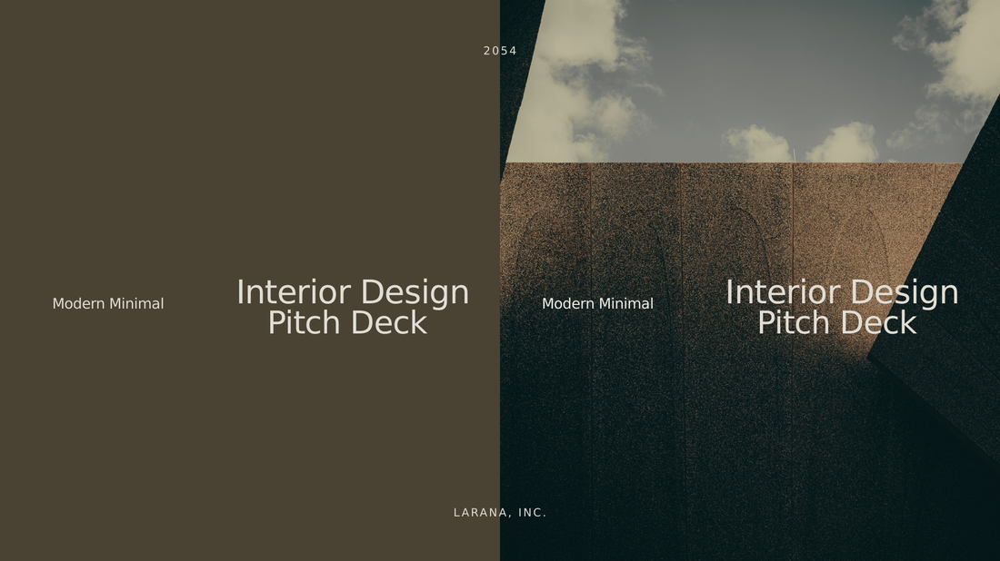 | 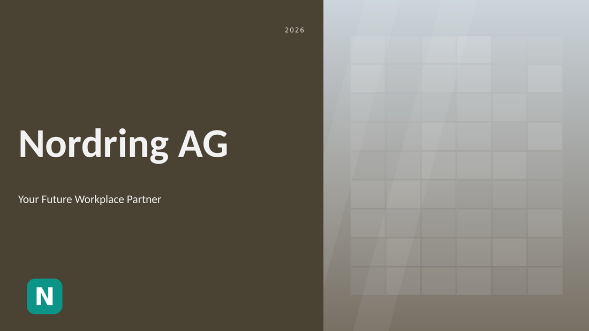 |

*Der Titel-Aufbau der Vorlage (Bildfläche, Jahr, Marke, Untertitel) wird verstanden und mit dem neuen
Firmeninhalt gefüllt — Träger-Design und Bildkomposition bleiben erhalten, der Titel sitzt in der
ausgewiesenen Textzone.*

### Beispiel 2 — Agenda / Inhaltsübersicht

| Vorlage | Generierte Folie |
|---|---|
| 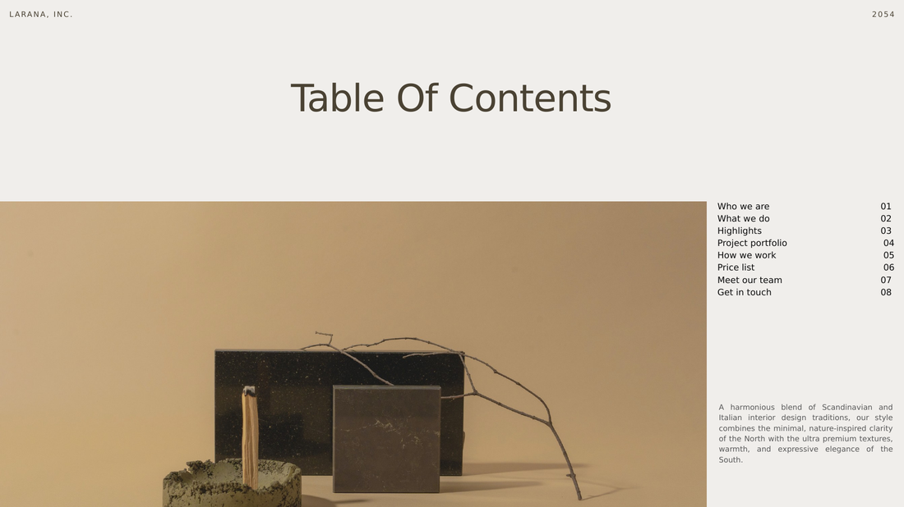 | 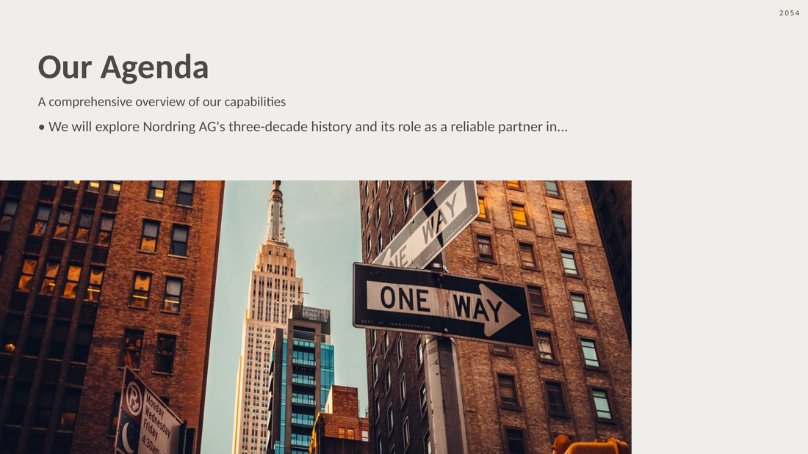 |

*Die Inhaltsverzeichnis-Folie der Vorlage wird als Agenda-Layout wiederverwendet und mit den
tatsächlichen Themen der neuen Präsentation belegt.*

### Beispiel 3 — Inhaltsfolie mit mehreren Punkten

| Vorlage | Generierte Folie |
|---|---|
| 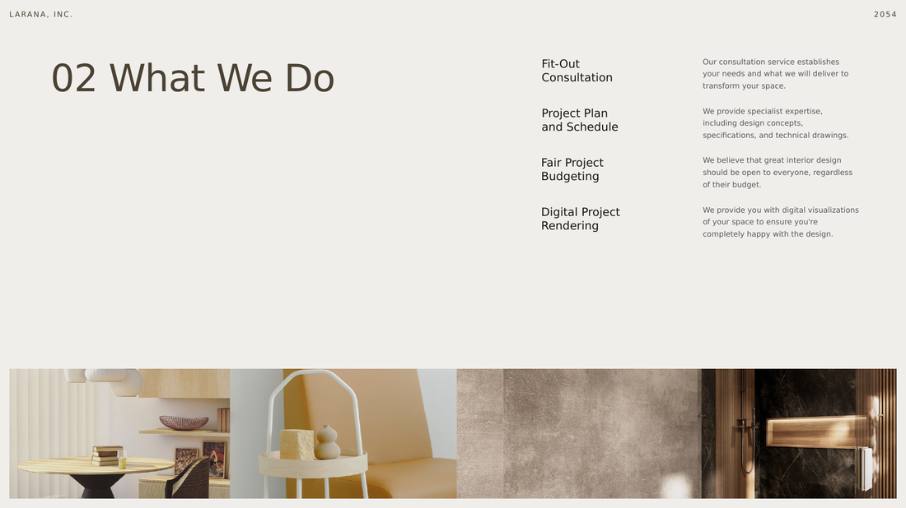 |  |

*Eine mehrteilige Inhaltsfolie: Das Layout der Vorlage trägt die generierten Kernaussagen, ohne dass
Text auf geschützte Design-Elemente gerät.*

> Hinweis: Die generierte Präsentation ist hier **de-identifiziert** — der reale Firmenname und die
> Kontaktdaten wurden durch neutrale Platzhalter ersetzt. Das gezeigte Layout, die Typografie und die
> Farbwelt entsprechen exakt dem echten System-Output; nur der Markentext ist ausgetauscht. Weitere
> Beispiele (Foto-Held-Folien, native Diagramme) lassen sich nach demselben Muster ergänzen.

---

## Roadmap & Stand

Produktiv als Generierungs-Worker in einer Agenten-Plattform. Aus Quellmaterial entstehen
mehrsprachige Präsentationen in der mitgegebenen Firmenvorlage.

**Belastbar etabliert:** Vision-First-Vorlagenverständnis mit inhalts-adressiertem Caching und
Fallback; Drei-Schichten-Rollentaxonomie; Marken-Erkennung über Wiederkehr; neun purpose-basierte
Renderer mit Budgets und Round-Robin-Verteilung; gemessene Platzierung; geometrische Selbstprüfung;
Web-Bildbeschaffung mit Vision-Verifikation; native Diagramme; mehrsprachige Ausgabe.

**Priorisierte offene Themen:** quantitative Evaluation über ein Vorlagen-Korpus (groß, der
überzeugendste fehlende Baustein); reichere Selbstprüfung für rein farbliche Lesbarkeitsprobleme
(mittel, kostenbewusst als selektive Vision-Prüfung riskanter Folien); breitere UI-Lokalisierung
(klein).

**Bewusst zurückgestellt:** Vision-Selbstprüfung pro Folie (zu teuer, sinnvoll nur selektiv);
feingranulare Angleichung jedes Diagramm-Details an den Vorlagen-Stil. Der größte Posten — die
Evaluation — ist bewusst benannt: Das System ist funktional stark, sein Nutzen aber bislang durch den
Betrieb belegt, nicht durch ein kontrolliertes Messverfahren.

---

## Kontakt

- **Name:** *(einfügen)*
- **E-Mail:** *(einfügen)*
- **Profil / LinkedIn / Website:** *(einfügen)*

Dieses Repository dokumentiert ein von mir konzipiertes und umgesetztes Produktivsystem. Der Quellcode
selbst ist proprietär und nicht Teil dieses Repositories.

---

Dieses Repository enthält keinen Quellcode und keine Betriebsdaten. Alle Diagramme und
Beschreibungen sind auf Architektur- und Konzeptebene gehalten.
